# 💾 Arquitetura de Estado & Persistência

Este documento descreve o padrão de gerenciamento de estado global, a estratégia de persistência local em disco e os mecanismos de validação e migração de schema do **Quantora**.

Arquivos-fonte:
* `src/store/useAppStore.ts`
* `src/core/storage/historyValidator.ts`

---

## 🏗️ Gerenciamento de Estado com Zustand

O aplicativo adota o **Zustand 5.0**, que oferece:
* Desempenho reativo de alta velocidade sem overhead de Context API do React.
* Seletores atômicos para evitar re-renderizações desnecessárias da interface.
* Integração nativa com middleware de persistência.

```mermaid
graph LR
    subgraph ZustandStore["🏪 useAppStore (Zustand)"]
        NavState["Navegação (activeTab)"]
        HistState["Histórico de Cálculos"]
        ProfState["Perfil & Gamificação"]
        QuizState["Progresso MatSpeed & Blitz"]
        DailyState["Desafio Diário"]
        SetState["Configurações & Temas"]
        ToastState["Fila de Notificações (Toasts)"]
    end

    subgraph StorageLayer["🗄️ Camada de Persistência"]
        Middleware["Zustand Persist Middleware"]
        Validator["historyValidator.ts"]
        LocalStorage["localStorage ('quantora-storage')"]
    end

    ZustandStore --> Middleware
    Middleware --> Validator
    Validator --> LocalStorage
```



---

## 🗃️ Estrutura do Estado Global (`AppState`)

### 1. Perfil & Estatísticas (`profile: UserProfile`)
```ts
interface UserProfile {
  totalXp: number;
  streakDays: number;
  lastActiveDate: string; // YYYY-MM-DD local
  unlockedAchievements: string[];
  stats: {
    totalCalculations: number;
    totalBhaskara: number;
    totalRegraDeTres: number;
    totalQuizCorrect: number;
    bestSurvivalRecord: number;
    scratchpadUses?: number;
    dailyChallengesCompleted?: number;
    blitzHighScore?: number;
    blitzMaxCombo?: number;
    bossesDefeated?: number;
    flawlessBossVictories?: number;
    criticalHits?: number;
  };
}
```

### 2. Histórico de Cálculos (`history: HistoryItem[]`)
* Armazena cálculos de Bhaskara e Regras de Três com payload serializado.
* Suporta fixação de itens favoritos (`isPinned: boolean`), remoção individual e limpeza total.
* Limite configurável pelo usuário (`settings.historyLimit`, padrão 50 itens).

### 3. Configurações Globais (`settings: AppSettings`)
* `theme`: `'light' | 'dark' | 'system'`
* `language`: `'pt' | 'en'`
* `decimalPlaces`: `2 | 4 | 6`
* `decimalSeparator`: `',' | '.'`
* `hasCompletedOnboarding`: `boolean`

---

## 🛡️ Validador de Histórico & Integridade (`historyValidator.ts`)

Para evitar falhas na inicialização devido a versões antigas ou dados corrompidos no `localStorage`:
1. **Validação Estrutural:** A função `validateHistorySchema(data)` inspeciona cada item do histórico, verificando tipos obrigatórios (`id`, `timestamp`, `type`, `title`, `summary`).
2. **Higienização:** Campos ausentes ou inválidos recebem valores de fallback seguros.
3. **Imunidade a Quebras:** Se o JSON no armazenamento estiver totalmente corrompido, o validador descarta os registros inválidos sem derrubar o aplicativo, garantindo que o usuário continue operando normalmente.

---

## 📦 Exportação e Importação de Dados

* **Desktop (Electron):** Comunicação com o processo principal via `window.electronAPI.saveFile()` e `window.electronAPI.openFile()`, permitindo salvar e carregar arquivos `.json` via caixa de diálogo nativa do Windows.
* **Web & Mobile (Navegador / Android):** Mecanismo de download de Blob JSON via elemento virtual `<a download>` e upload via `<input type="file">`.

---

## 🔗 Links Relacionados
* [[Quantora - Visao Geral]]
* [[Gamificacao & Niveis]]
* [[Suite de Testes & Qualidade]]
