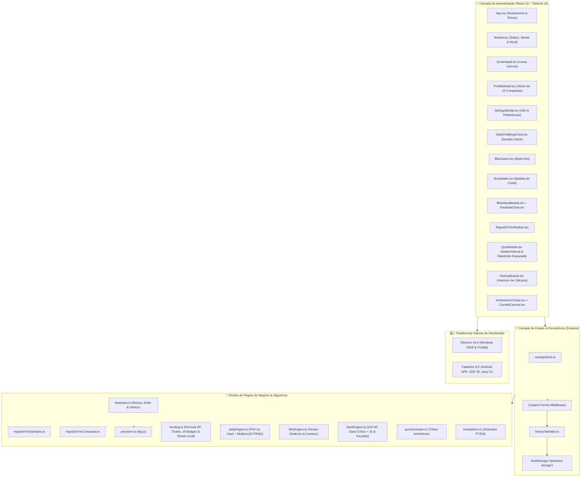

# 🗺️ Mapa Visual de Dependências & Camadas — Quantora

Este documento detalha o mapa arquitetural completo de bibliotecas, camadas internas e plataformas suportadas pelo **Quantora**.

---

## 📊 Diagrama Arquitetural do Sistema

---

## 📦 Inventário Detalhado de Dependências (`package.json`)

### 1. 🚀 Dependências de Produção (`dependencies`)
| Pacote | Versão | Função na Aplicação |
| :--- | :---: | :--- |
| **`react` / `react-dom`** | `^19.2.8` | Motor reativo de renderização da UI |
| **`zustand`** | `^5.0.15` | Gestão atômica de estado global com persistência local |
| **`big.js`** | `^7.0.1` | Cálculos aritméticos em ponto flutuante arbitrário e seguro |
| **`lucide-react`** | `^1.43.0` | Conjunto leve e consistente de ícones vetoriais SVG |
| **`clsx` + `tailwind-merge`** | `^2.1.1` / `^3.6.0` | Concatenação inteligente e resolução de classes CSS |
| **`electron-updater`** | `^6.8.9` | Verificação e download assíncrono de atualizações no Windows |
| **`@capacitor/core`** | `^8.5.1` | Ponte de comunicação com APIs do sistema operacional mobile |

---

### 2. 🛠️ Ferramental de Desenvolvimento (`devDependencies`)
| Pacote | Versão | Função |
| :--- | :---: | :--- |
| **`vite` + `@vitejs/plugin-react`** | `^8.2.2` / `^6.1.0` | Bundler e servidor ultrarrápido com Hot Module Replacement (HMR) |
| **`tailwindcss` + `@tailwindcss/vite`**| `^4.3.3` | Framework utilitário de CSS compilado nativamente via Vite v4 |
| **`typescript`** | `~6.0.2` | Verificação estática de tipos estritos |
| **`vitest`** | `^5.0.0` | Executor de 154 testes unitários e testes de estresse |
| **`oxlint`** | `^1.79.0` | Linter em Rust para garantia de código limpo e seguro |
| **`electron` + `electron-builder`** | `^44.3.0` / `^26.15.3` | Ambiente de execução desktop e gerador de instaladores NSIS |
| **`@capacitor/android` + `@capacitor/cli`** | `^8.5.1` | Ferramental de sincronização e compilação do Android nativo |

---

## 🔗 Links Relacionados
* [[Quantora - Visao Geral]]
* [[Deploy & Releases]]
* [[Suite de Testes & Qualidade]]
